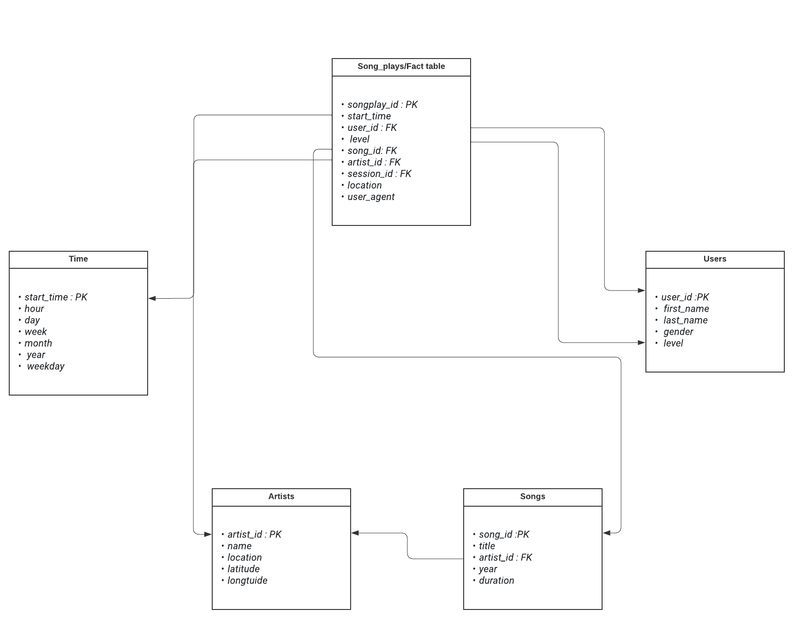

# Song_DB

**Introduction**

There is a company called sparkify having an Application  for live songs and their data on JSON files and they want to transfer the data to Postgres DB 

**Steps** 

1. Analyze the data source and define the keys
2. Create a schema that will help to have a high-performance query (Star Schema)

3. Create DB using shell and user and gain all privileges for the user on the DB
4. Create a python script that will Create tables based on the UML 
5. Create an ETL process that will parse the JSON files and Insert the data in the DB
6. Build an SQL script that will query the data and test the performance 
